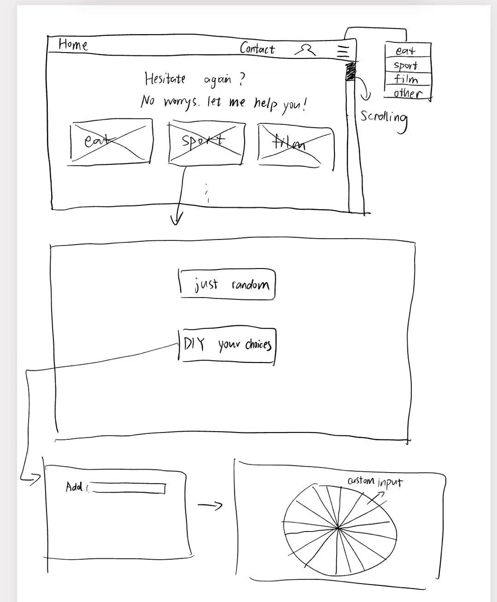

# Final Project Proposal

## Concept / Theme

**Project Title:** Decision Helper – "Hesitate again? No worries! Let me help you!"

**Description:**  
This website is designed to help users make decision. 
1. Users can input own custom list of options(e.g. the list of the canteen they are struggling with, the list of movies they plan to watch) and the website will give them the randon choose among these decisions. 
2. Users can also skip the input and directly click the randon button of my website under the category they want (e.g. lunch, sport), and the randon selection will be given by the website among the database I built for it. 

The target users of this project are people who feel anxious when making a decision in daily life, maybe because they don't want to be responsible for the possible good/bad result of the choice they made, or maybe there are so many choices in the daily life. The website will provide a relaxing and interesting way to relieve their psychological burden and make the process of "choice" fun, interesting and even a bit of ritual.

---

## Visual & UX Inspiration

**Main Inspiration:** [Wheel of Names](https://wheelofnames.com/)  
This site offers a visually interactive randomizer using a spinning wheel. I like the way it gives decision-making a sense of anticipation and ritual through animation and sound.

### Optional Inspiration Elements

**Mood & Style:**
- Soft, macaron color palette or morandi color palette 
- Rounded fonts for a friendly, casual feel (e.g. Quicksand, Nunito)
- Layout is clean and centered, focusing user attention on the decision tool

**UX Notes:**
- Visual feedback is essential: animations and color shifts add emotional tone
- Use colors and font to minimize the anxiety of the users
- Possibly include light sound effects during wheel spin or result announcement

---

## HTML/CSS/JS Concepts I Will Use

From class, I plan to incorporate the following:

- HTML forms to let users input options
- CSS animations (e.g., transitions, keyframes for wheel spinning effects)
- JavaScript:
  - Arrays and loops (to store user options)
  - Random number generation (to select from input)
  - DOM manipulation (adding/removing options, showing results)
  - Event listeners (click to start wheel, reset, etc.)
  - Optional: `localStorage` to save decision history

---

## Wireframe / Sitemap

### Site Flow:

1. **Homepage**
   - Intro text: 
   - Category of the different types of choice the users want to make. 

2. **Input Page**
   - Input field for user options (minimum 2)
   - "Add Option" button
   - Option preview list
   - "Random Decide!" button

3. **Decision Page**
   - Animated spinning wheel (for custom input)
   - Click Button directly to the randon result (no custom input)
   - Visual effects & sound
   - Result display with optional fun message
   - “Try Again” or “Start Over” buttons

4. **(Optional)** History Page
   - List of past choices (from `localStorage`)
   - Option to clear history

