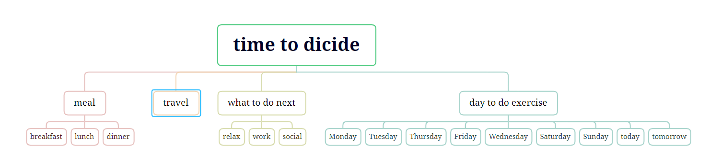

# Theme:a website made for people who hard to make a decision #
## insipiration: ##
1. I have a person who always hard ro decide what to eat for lunch/dinner, even for the trip I will hesitate for a long time. This website could help me save many time to make a quick decision
2. website: https://toolshu.com/en/eat (this is not my inspiration website but I want to build a website that has similar function like this)
## skill contained ##
1. external css built
2. guideline to category the field of decision this website will made for you
3. function of randon selection
## skill to learn ##
1. build a database and insert it into my project (for example like an excel document for listing the name of the food or countries' name)
2. learn to build a program to make randon selection
### sitemap ###
